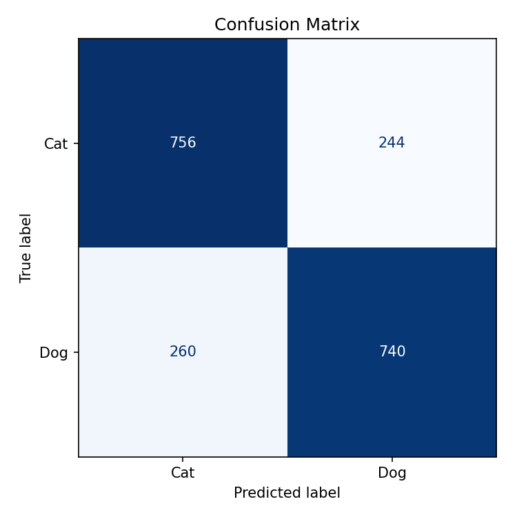
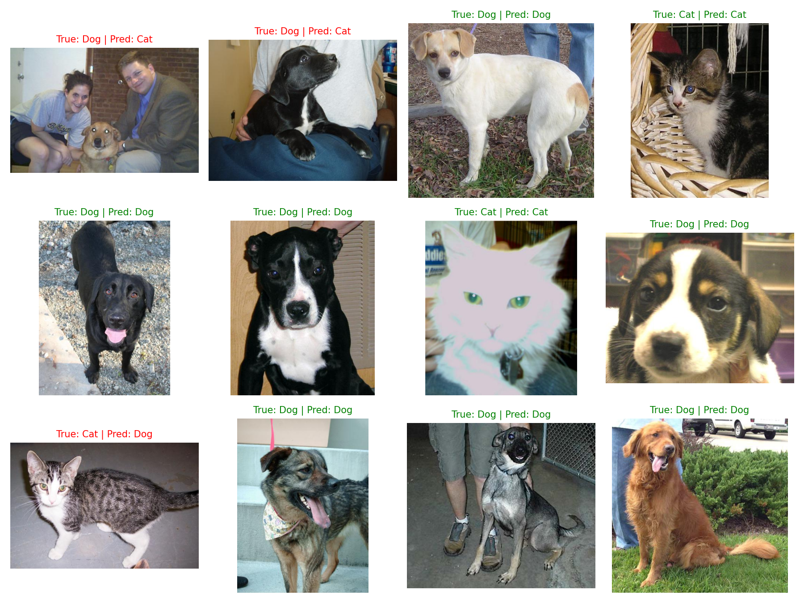

# 🐱🐶 Cat vs Dog Image Classification using SVM

## 📌 Project Overview

This project implements a Machine Learning model to classify images as either **Cat** or **Dog** using a **Support Vector Machine (SVM)** classifier.

The dataset consists of cat and dog images. Images are preprocessed, converted into numerical feature vectors, and then used to train an SVM model for binary classification.

---

## 🚀 Features

- Image preprocessing and resizing
- Feature extraction from images
- Binary classification (Cat vs Dog)
- Support Vector Machine (SVM) model
- Model evaluation using confusion matrix
- Sample prediction visualization

---

## 🛠️ Technologies Used

- Python
- NumPy
- OpenCV
- Scikit-learn
- Matplotlib
- Joblib

---

## 📂 Project Structure

```
SCT_ML_03/
│
├── svm_cats_dogs.py
├── confusion_matrix.png
├── sample_predictions.png
├── README.md
├── .gitignore
│
└── PetImages/   (Ignored from GitHub)
```

---

## 📊 Dataset

The project uses the Microsoft Cats and Dogs dataset.

Dataset structure:

```
PetImages/
├── Cat/
└── Dog/
```

The dataset is excluded from GitHub because of its large size.

---

## ⚙️ Installation

Clone the repository:

```bash
git clone https://github.com/deepthiii19/SCT_ML_03.git
cd SCT_ML_03
```

Install dependencies:

```bash
pip install numpy opencv-python matplotlib scikit-learn joblib
```

---

## ▶️ Running the Project

Run:

```bash
python svm_cats_dogs.py
```

The script will:

1. Load images
2. Preprocess data
3. Train the SVM model
4. Evaluate performance
5. Generate prediction results

---

## 📈 Results

### Confusion Matrix

The confusion matrix shows the classification performance of the model.



### Sample Predictions

Example predictions made by the trained model.



---

## 🎯 Learning Outcomes

Through this project, I learned:

- Image preprocessing techniques
- Feature extraction from images
- Support Vector Machine (SVM) classification
- Model evaluation metrics
- Working with image datasets in Python

---


GitHub: https://github.com/deepthiii19
